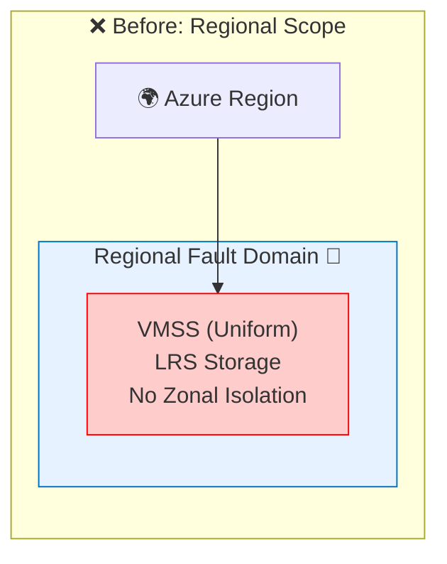
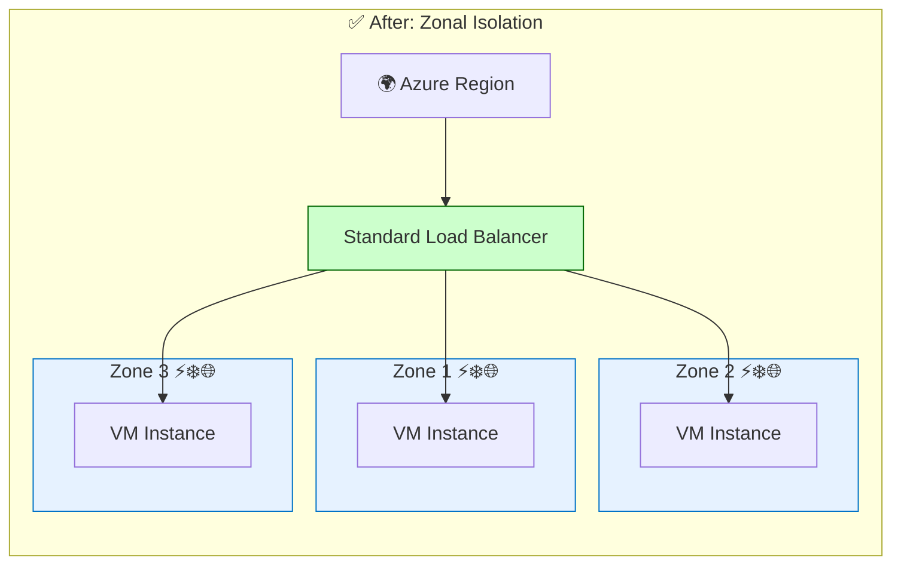

# GitHub Copilot Resiliency Demo

This repository demonstrates how **GitHub Copilot** can transform basic Azure infrastructure into **production-grade, resilient deployments** by leveraging the **Azure Proactive Resiliency Library (APRL)** and Microsoft best practices.

## ⚠️ The Problem

Without GitHub Copilot, identifying and fixing resiliency gaps is a manual, error-prone process:

1. **Manual Research**: You must find and read scattered documentation and architecture guides (APRL, Well-Architected Framework).
2. **Code Inspection**: You have to manually review Infrastructure-as-Code (IaC) line-by-line to spot missing properties like `zones`, `loadBalancer`, or `healthProbe`.
3. **Complex Implementation**: Writing the correct Bicep code for advanced features (e.g., Rolling Upgrades, ZRS) requires deep syntax knowledge.

## 🎯 Purpose

Showcase how GitHub Copilot, guided by custom instructions, can:

- **Analyze** existing Infrastructure-as-Code (IaC) for resiliency gaps.
- **Research** best practices from official documentation and APRL.
- **Generate** enterprise-ready Bicep templates with comprehensive resiliency features.

## 📁 Repository Structure

- `.github/copilot-instructions.md`: Custom instructions defining the "Azure Infrastructure Architect" persona and resiliency rules.
- `iac.bicep`: The starting point - a basic, non-resilient VMSS deployment.
- `demo-guide.md`: Step-by-step instructions for running the demo.
- `iac-resilient.bicep`: (Generated during demo) The resilient, production-ready output.

## 🚀 The Transformation

### 📐 Architecture Diagram

#### Before

#### After

### Before: Basic Deployment (`iac.bicep`)

A standard Virtual Machine Scale Set with common single points of failure:

- ❌ **Regional Deployment**: No explicit zone redundancy; vulnerable to single datacenter failures.
- ❌ **Local Storage (LRS)**: Data is only replicated within a single physical location.
- ❌ **Manual Operations**: No automated health monitoring, repairs, or rolling upgrades.

### After: Resilient Deployment (`iac-resilient.bicep`)

Copilot generates a self-healing infrastructure that survives failures:

- ✅ **Multi-Zone (Zones 1, 2, 3)**: Distributed across datacenters (99.99% SLA).
- ✅ **Zone-Redundant Storage (ZRS)**: Data survives zonal failures (12-nines durability).
- ✅ **Automated Maintenance**: Application Health Extensions, automatic instance repairs, and safe rolling upgrades.
- ✅ **Network Hardening**: Standard Load Balancer and Network Security Groups.

## 🔑 Key Resiliency Improvements

| Feature          | Impact            | Before                  | After                     |
| ---------------- | ----------------- | ----------------------- | ------------------------- |
| **Availability** | SLA & Uptime      | ❌ Regional (Non-Zonal) | ✅ 3 Zones (99.99%)       |
| **Storage**      | Durability        | ❌ LRS (11-nines)       | ✅ ZRS (12-nines)         |
| **Self-Healing** | Recovery Time     | ❌ Manual Intervention  | ✅ Automated Repair       |
| **Updates**      | Deployment Safety | ❌ Manual Update        | ✅ Rolling Upgrade Policy |
| **Traffic**      | Load Balancing    | ❌ None                 | ✅ Standard Load Balancer |

## 🛠️ Running the Demo

1. **Review Instructions**: Open `.github/copilot-instructions.md` to see how we enforce resiliency standards.
2. **Analyze**: Open `iac.bicep` and ask Copilot:
   > "Analyze this infrastructure for resiliency gaps."
3. **Generate**: Ask Copilot to improve the code:
   > "Improve the infrastructure resiliency by implementing Azure best practices from APRL and official Microsoft documentation. Generate new file with improved iac."
4. **Compare**: Ask Copilot to explain the value:
   > "Compare iac.bicep and iac-resilient.bicep. Summarise the differences in resiliency features and present them in a table."

## 📚 References

- [Azure Proactive Resiliency Library (APRL)](https://github.com/Azure/Azure-Proactive-Resiliency-Library-v2)
- [Azure Well-Architected Framework](https://learn.microsoft.com/en-us/azure/well-architected/)
- [Azure Virtual Machine Scale Sets](https://learn.microsoft.com/en-us/azure/virtual-machine-scale-sets/)

---

Powered by GitHub Copilot & Azure Best Practices
